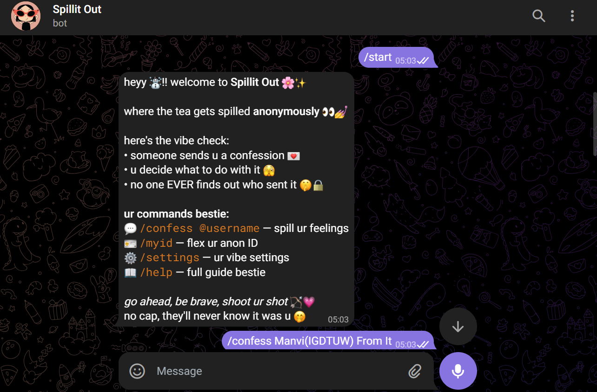
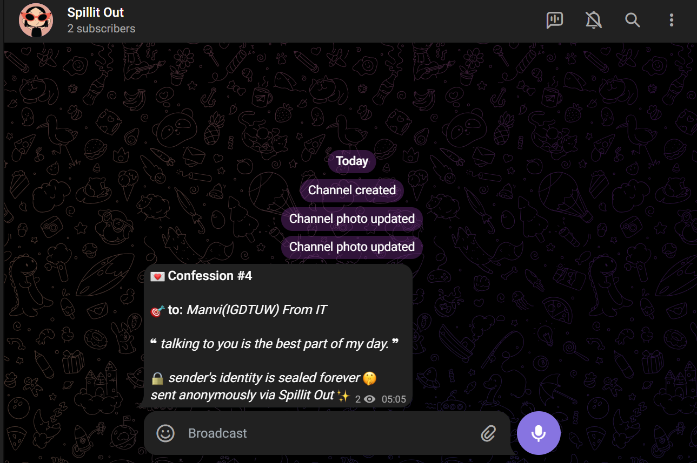

# 🌸 Spillit Out — Anonymous Confession Bot




A Gen-Z styled, feature-rich Telegram Bot for anonymous confessions. Spill your feelings without revealing your identity. Built with `python-telegram-bot` and SQLite.

## ✨ Features

- **🎯 Two-Path Confession System:**
  - **Know their username?** Send it privately to them first. They choose whether to post it to the channel, keep it private, or delete it.
  - **Don't know their username?** Write a description (e.g., "Sarah from class 5") and it goes straight to the Admin Queue for review before being posted.
- **🛡️ Admin Approval Queue:** Every public confession must be approved by an Admin before it goes live on the channel to keep the environment safe.
- **🔥 Crush Match Alerts:** If two people confess to each other, they BOTH get an exciting "Match" notification!
- **📸 Full Media Support:** Supports text, photos, voice notes, and videos.
- **💬 Anonymous Replies:** Users can reply to confessions anonymously without revealing their identity.
- **⚙️ User Settings:** Users can toggle whether they want to receive confessions or direct messages.
- **🚩 Reporting System:** Users can report inappropriate confessions for Admins to review.

---

## 🚀 Setup & Installation (Local)

1. **Clone the repository or download the files.**
2. **Install dependencies:**
   ```bash
   pip install -r requirements.txt
   ```
3. **Set up your environment variables:**
   Copy `.env.example` to `.env` and fill in your details:
   ```env
   BOT_TOKEN=your_bot_token_here
   GROUP_CHAT_ID=-100123456789  # The Channel/Group ID where approved confessions are posted
   ADMIN_IDS=12345678,87654321  # Comma-separated list of Admin Telegram IDs
   ```
   *Note: Ensure the bot is added to the channel as an Admin with "Post Messages" permission.*
4. **Run the bot:**
   ```bash
   python bot.py
   ```

---

## 🌐 Deploying to the Cloud (24/7 Hosting)

To keep the bot running 24/7 without keeping your computer on, we recommend deploying to **Railway** (easiest and free tier available).

1. Upload your code to a GitHub repository.
2. Sign up at [Railway.app](https://railway.app/).
3. Click **New Project** → **Deploy from GitHub repo**.
4. Go to the **Variables** tab in your Railway project and add your `.env` variables (`BOT_TOKEN`, `GROUP_CHAT_ID`, `ADMIN_IDS`).
5. Ensure you have a `Procfile` in your repository with the following content:
   ```
   worker: python bot.py
   ```
6. Railway will automatically build and deploy your bot!

---

## 📱 Bot Commands

### User Commands
- `/start` — Register and get the vibe check.
- `/confess @username` — Confess to a specific user (privately).
- `/confess <name/description>` — Confess to someone you don't know the username of (goes to Admin queue).
- `/myid` — Get your unique anonymous ID to share.
- `/settings` — Toggle receiving confessions or anonymous replies.
- `/report <id> <reason>` — Report a problematic confession to the Admins.
- `/cancel` — Cancel the current operation.
- `/help` — Show the guide.

### Admin Commands
- `/ban <user_id>` — Ban a user from using the bot.
- `/unban <user_id>` — Unban a user.
- `/delete <confession_id>` — Delete a specific confession entirely.
- `/stats` — View bot usage statistics.
- `/reports` — View the list of user reports.

---

## 📂 Project Structure

```
├── bot.py                  # Main entry point and bot initialization
├── database.py             # SQLite database schema, queries, and connection handling
├── .env                    # Environment variables (do not commit this)
├── .env.example            # Template for environment variables
├── requirements.txt        # Python dependencies
├── migrate.py              # Script for database schema migrations
├── middleware/
│   └── rate_limit.py       # Rate limiting logic to prevent spam
└── handlers/
    ├── admin.py            # Admin commands (/ban, /stats, etc.)
    ├── approval.py         # Callback handlers for Approve/Reject buttons
    ├── confess.py          # Core logic for sending confessions
    ├── match.py            # Crush match checking and notifications
    ├── misc.py             # Miscellaneous commands (/help, /settings, /report)
    ├── replies.py          # Logic for anonymous replies
    └── start.py            # /start command handler
```

---

*Spill your heart out, stay kind, and have fun! 🌸✨*

**Created by [manviisinha](https://github.com/manviisinha)** 👑
